<div style="padding:10px;
            color:#87CEEB;
            margin:10px;
            font-size:130%;
            display:fill;
            border-radius:5px;
            border-style: solid;
            border-color: #87CEEB;
            background-color:#000000;
            overflow:hidden;
            font-weight:400"><b>Importing Libraries</b>
</div>


```python
import pandas as pd
import numpy as np
import matplotlib.pyplot as plt
import seaborn as sns
import warnings 
warnings.filterwarnings("ignore")
```

<div style="padding:10px;
            color:#87CEEB;
            margin:10px;
            font-size:130%;
            display:fill;
            border-radius:5px;
            border-style: solid;
            border-color: #87CEEB;
            background-color:#000000;
            overflow:hidden;
            font-weight:400"><b>Loading the Dataset</b>
</div>


```python
data = pd.read_csv(r"C:\Users\nandh\OneDrive\Documents\shopping_sales_data.csv")
data.sample(5)
```


<div>
<style scoped>
    .dataframe tbody tr th:only-of-type {
        vertical-align: middle;
    }

    .dataframe tbody tr th {
        vertical-align: top;
    }

    .dataframe thead th {
        text-align: right;
    }
</style>
<table border="1" class="dataframe">
  <thead>
    <tr style="text-align: right;">
      <th></th>
      <th>Customer ID</th>
      <th>Age</th>
      <th>Gender</th>
      <th>Item Purchased</th>
      <th>Category</th>
      <th>Purchase Amount (USD)</th>
      <th>Location</th>
      <th>Size</th>
      <th>Color</th>
      <th>Season</th>
      <th>Review Rating</th>
      <th>Subscription Status</th>
      <th>Shipping Type</th>
      <th>Discount Applied</th>
      <th>Promo Code Used</th>
      <th>Previous Purchases</th>
      <th>Payment Method</th>
      <th>Frequency of Purchases</th>
    </tr>
  </thead>
  <tbody>
    <tr>
      <th>539</th>
      <td>540</td>
      <td>49</td>
      <td>Male</td>
      <td>Coat</td>
      <td>Outerwear</td>
      <td>48</td>
      <td>Wyoming</td>
      <td>M</td>
      <td>Violet</td>
      <td>Winter</td>
      <td>4.0</td>
      <td>Yes</td>
      <td>Store Pickup</td>
      <td>Yes</td>
      <td>Yes</td>
      <td>49</td>
      <td>Debit Card</td>
      <td>Weekly</td>
    </tr>
    <tr>
      <th>2497</th>
      <td>2498</td>
      <td>35</td>
      <td>Male</td>
      <td>Backpack</td>
      <td>Accessories</td>
      <td>40</td>
      <td>Colorado</td>
      <td>M</td>
      <td>Violet</td>
      <td>Summer</td>
      <td>4.2</td>
      <td>No</td>
      <td>Standard</td>
      <td>No</td>
      <td>No</td>
      <td>28</td>
      <td>Bank Transfer</td>
      <td>Annually</td>
    </tr>
    <tr>
      <th>2658</th>
      <td>2659</td>
      <td>52</td>
      <td>Female</td>
      <td>Handbag</td>
      <td>Accessories</td>
      <td>47</td>
      <td>Ohio</td>
      <td>XL</td>
      <td>Indigo</td>
      <td>Summer</td>
      <td>3.2</td>
      <td>No</td>
      <td>Next Day Air</td>
      <td>No</td>
      <td>No</td>
      <td>39</td>
      <td>PayPal</td>
      <td>Monthly</td>
    </tr>
    <tr>
      <th>3521</th>
      <td>3522</td>
      <td>52</td>
      <td>Female</td>
      <td>Shoes</td>
      <td>Footwear</td>
      <td>50</td>
      <td>Maryland</td>
      <td>M</td>
      <td>Pink</td>
      <td>Winter</td>
      <td>3.7</td>
      <td>No</td>
      <td>Store Pickup</td>
      <td>No</td>
      <td>No</td>
      <td>35</td>
      <td>Venmo</td>
      <td>Weekly</td>
    </tr>
    <tr>
      <th>2099</th>
      <td>2100</td>
      <td>31</td>
      <td>Male</td>
      <td>T-shirt</td>
      <td>Clothing</td>
      <td>78</td>
      <td>Oklahoma</td>
      <td>L</td>
      <td>Green</td>
      <td>Summer</td>
      <td>2.9</td>
      <td>No</td>
      <td>Express</td>
      <td>No</td>
      <td>No</td>
      <td>50</td>
      <td>PayPal</td>
      <td>Annually</td>
    </tr>
  </tbody>
</table>
</div>


<div style="padding:10px;
            color:#87CEEB;
            margin:10px;
            font-size:130%;
            display:fill;
            border-radius:5px;
            border-style: solid;
            border-color: #87CEEB;
            background-color:#000000;
            overflow:hidden;
            font-weight:400"><b>Checking the shape of the Dataset</b>
</div>


```python
data.shape
```


    (3900, 18)


<div style="padding:10px;
            color:#87CEEB;
            margin:10px;
            font-size:130%;
            display:fill;
            border-radius:5px;
            border-style: solid;
            border-color: #87CEEB;
            background-color:#000000;
            overflow:hidden;
            font-weight:400"><b>Checking the number of Columns in the Dataset</b>
</div>


```python
data.columns
```


    Index(['Customer ID', 'Age', 'Gender', 'Item Purchased', 'Category',
           'Purchase Amount (USD)', 'Location', 'Size', 'Color', 'Season',
           'Review Rating', 'Subscription Status', 'Shipping Type',
           'Discount Applied', 'Promo Code Used', 'Previous Purchases',
           'Payment Method', 'Frequency of Purchases'],
          dtype='object')


<div style="padding:10px;
            color:#87CEEB;
            margin:10px;
            font-size:130%;
            display:fill;
            border-radius:5px;
            border-style: solid;
            border-color: #87CEEB;
            background-color:#000000;
            overflow:hidden;
            font-weight:400"><b>Information about the Dataset</b>
</div>


```python
data.info()
```

    <class 'pandas.core.frame.DataFrame'>
    RangeIndex: 3900 entries, 0 to 3899
    Data columns (total 18 columns):
     #   Column                  Non-Null Count  Dtype  
    ---  ------                  --------------  -----  
     0   Customer ID             3900 non-null   int64  
     1   Age                     3900 non-null   int64  
     2   Gender                  3900 non-null   object 
     3   Item Purchased          3900 non-null   object 
     4   Category                3900 non-null   object 
     5   Purchase Amount (USD)   3900 non-null   int64  
     6   Location                3900 non-null   object 
     7   Size                    3900 non-null   object 
     8   Color                   3900 non-null   object 
     9   Season                  3900 non-null   object 
     10  Review Rating           3900 non-null   float64
     11  Subscription Status     3900 non-null   object 
     12  Shipping Type           3900 non-null   object 
     13  Discount Applied        3900 non-null   object 
     14  Promo Code Used         3900 non-null   object 
     15  Previous Purchases      3900 non-null   int64  
     16  Payment Method          3900 non-null   object 
     17  Frequency of Purchases  3900 non-null   object 
    dtypes: float64(1), int64(4), object(13)
    memory usage: 548.6+ KB
    


```python
data.describe()
```


<div>
<style scoped>
    .dataframe tbody tr th:only-of-type {
        vertical-align: middle;
    }

    .dataframe tbody tr th {
        vertical-align: top;
    }

    .dataframe thead th {
        text-align: right;
    }
</style>
<table border="1" class="dataframe">
  <thead>
    <tr style="text-align: right;">
      <th></th>
      <th>Customer ID</th>
      <th>Age</th>
      <th>Purchase Amount (USD)</th>
      <th>Review Rating</th>
      <th>Previous Purchases</th>
    </tr>
  </thead>
  <tbody>
    <tr>
      <th>count</th>
      <td>3900.000000</td>
      <td>3900.000000</td>
      <td>3900.000000</td>
      <td>3900.000000</td>
      <td>3900.000000</td>
    </tr>
    <tr>
      <th>mean</th>
      <td>1950.500000</td>
      <td>44.068462</td>
      <td>59.764359</td>
      <td>3.749949</td>
      <td>25.351538</td>
    </tr>
    <tr>
      <th>std</th>
      <td>1125.977353</td>
      <td>15.207589</td>
      <td>23.685392</td>
      <td>0.716223</td>
      <td>14.447125</td>
    </tr>
    <tr>
      <th>min</th>
      <td>1.000000</td>
      <td>18.000000</td>
      <td>20.000000</td>
      <td>2.500000</td>
      <td>1.000000</td>
    </tr>
    <tr>
      <th>25%</th>
      <td>975.750000</td>
      <td>31.000000</td>
      <td>39.000000</td>
      <td>3.100000</td>
      <td>13.000000</td>
    </tr>
    <tr>
      <th>50%</th>
      <td>1950.500000</td>
      <td>44.000000</td>
      <td>60.000000</td>
      <td>3.700000</td>
      <td>25.000000</td>
    </tr>
    <tr>
      <th>75%</th>
      <td>2925.250000</td>
      <td>57.000000</td>
      <td>81.000000</td>
      <td>4.400000</td>
      <td>38.000000</td>
    </tr>
    <tr>
      <th>max</th>
      <td>3900.000000</td>
      <td>70.000000</td>
      <td>100.000000</td>
      <td>5.000000</td>
      <td>50.000000</td>
    </tr>
  </tbody>
</table>
</div>


<div style="padding:10px;
            color:#87CEEB;
            margin:10px;
            font-size:130%;
            display:fill;
            border-radius:5px;
            border-style: solid;
            border-color: #87CEEB;
            background-color:#000000;
            overflow:hidden;
            font-weight:400"><b>Checking if there are any null values present in the dataset or not ?</b>
</div>


```python
data.isnull().sum()
```


    Customer ID               0
    Age                       0
    Gender                    0
    Item Purchased            0
    Category                  0
    Purchase Amount (USD)     0
    Location                  0
    Size                      0
    Color                     0
    Season                    0
    Review Rating             0
    Subscription Status       0
    Shipping Type             0
    Discount Applied          0
    Promo Code Used           0
    Previous Purchases        0
    Payment Method            0
    Frequency of Purchases    0
    dtype: int64


<div style="padding:10px;
            color:#87CEEB;
            margin:10px;
            font-size:130%;
            display:fill;
            border-radius:5px;
            border-style: solid;
            border-color: #87CEEB;
            background-color:#000000;
            overflow:hidden;
            font-weight:400"><b>Checking if there are any duplicate values present in the dataset or not ?</b>
</div>


```python
data.duplicated().sum()
```


    0


```python
plt.figure(figsize = (10, 5))
ax = data["Gender"].value_counts().plot(kind = 'bar', color = 'Blue', rot = 0)
ax.set_xticklabels(('Male', 'Female'))

for p in ax.patches:
    ax.annotate(int(p.get_height()), (p.get_x() + 0.25, p.get_height() + 1), ha = 'center', va = 'bottom', color = 'black')
    ax.tick_params(axis = 'both', labelsize = 15)
plt.xlabel('Employment Type', weight = "bold", color = "#D71313", fontsize = 14, labelpad = 20)
plt.ylabel('Number of Occurrences', weight = "bold", color = "#D71313", fontsize = 14, labelpad = 20);
```


    
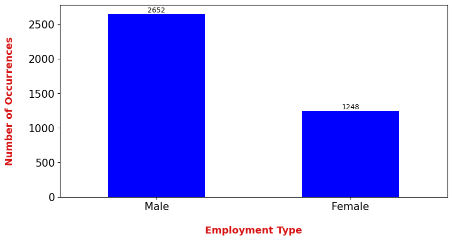
    


```python
plt.figure(figsize = (10, 5))

counts = data["Gender"].value_counts()
explode = (0, 0.1)

counts.plot(kind = 'pie', fontsize = 12, explode = explode, autopct = '%1.1f%%')
plt.xlabel('Gender', weight = "bold", color = "#2F0F5D", fontsize = 14, labelpad = 20)
plt.axis('equal')
plt.legend(labels = counts.index, loc = "best")
plt.show()
```


    
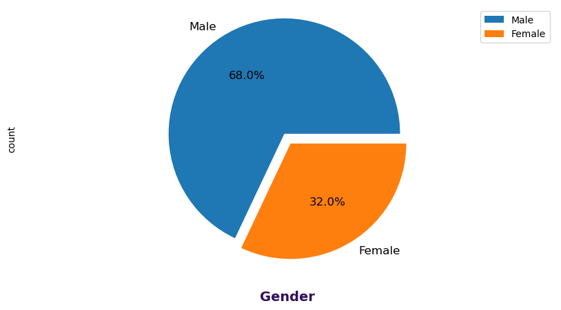
    


```python
fig, ax = plt.subplots(figsize = (10, 5))

ax.hist(data['Age'], bins = 25, edgecolor = 'black', alpha = 0.7, color = 'skyblue', density = True)
data['Age'].plot(kind = 'kde', color = 'red')

ax.set_xlabel('Age')
ax.set_ylabel('Count / Density')
ax.set_title('Age Distribution Histogram with Density Curve')
ax.legend(['Density Curve', 'Histogram'])
plt.show()
```


    
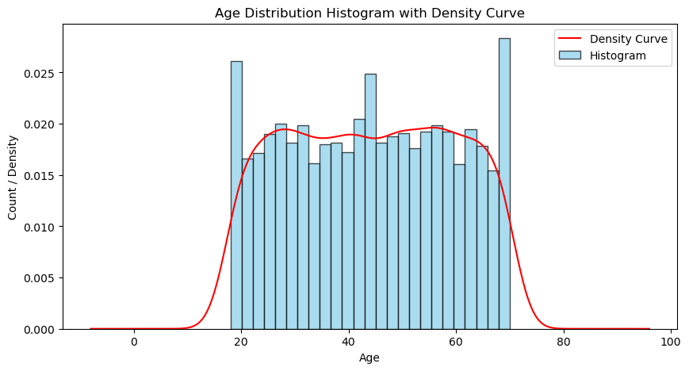
    


```python
data["Category"].value_counts()
```


    Category
    Clothing       1737
    Accessories    1240
    Footwear        599
    Outerwear       324
    Name: count, dtype: int64


```python
plt.figure(figsize = (10, 5))
ax = data["Category"].value_counts().plot(kind = 'bar', color = 'Blue', rot = 0)
ax.set_xticklabels(('Clothing', 'Accessories', 'Footwear', 'Outerwear'))

for p in ax.patches:
    ax.annotate(int(p.get_height()), (p.get_x() + 0.25, p.get_height() + 1), ha = 'center', va = 'bottom', color = 'black')
    ax.tick_params(axis = 'both', labelsize = 15)
plt.xlabel('Employment Type', weight = "bold", color = "#D71313", fontsize = 14, labelpad = 20)
plt.ylabel('Number of Occurrences', weight = "bold", color = "#D71313", fontsize = 14, labelpad = 20);
```


    
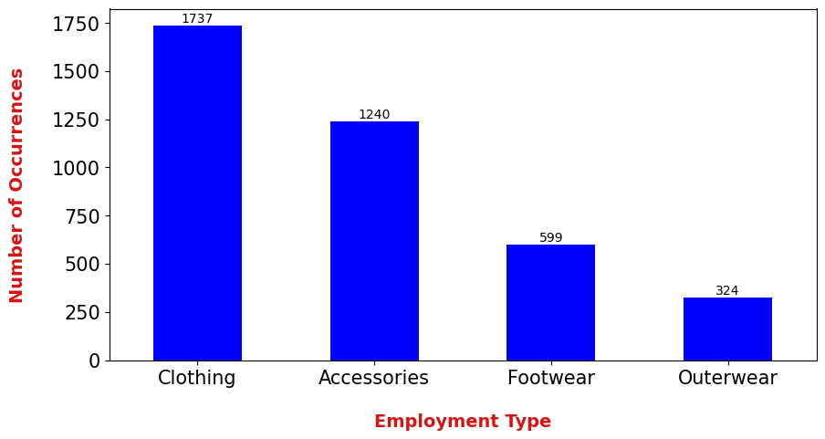
    


```python
plt.figure(figsize = (10, 5))

counts = data["Category"].value_counts()
explode = (0.1, 0.0, 0.0, 0.0)

counts.plot(kind = 'pie', fontsize = 12, explode = explode, autopct = '%1.1f%%')
plt.xlabel('Gender', weight = "bold", color = "#2F0F5D", fontsize = 14, labelpad = 20)
plt.axis('equal')
plt.legend(labels = counts.index, loc = "best")
plt.show()
```


    
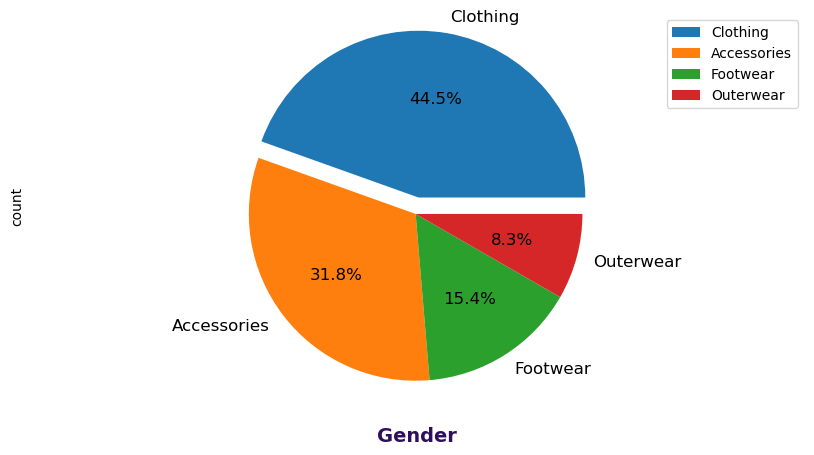
    


```python
data["Item Purchased"].value_counts()
```


    Item Purchased
    Blouse        171
    Jewelry       171
    Pants         171
    Shirt         169
    Dress         166
    Sweater       164
    Jacket        163
    Belt          161
    Sunglasses    161
    Coat          161
    Sandals       160
    Socks         159
    Skirt         158
    Shorts        157
    Scarf         157
    Hat           154
    Handbag       153
    Hoodie        151
    Shoes         150
    T-shirt       147
    Sneakers      145
    Boots         144
    Backpack      143
    Gloves        140
    Jeans         124
    Name: count, dtype: int64


```python
plt.figure(figsize = (10, 5))
data["Item Purchased"].value_counts().sort_values(ascending = True).plot(kind = 'barh', color = sns.color_palette('tab20'), edgecolor = 'black')
plt.ylabel('Item Purchased', fontsize = 16)
plt.xlabel('\nNumber of Occurrences', fontsize = 16)
plt.title('Item Purchased\n', fontsize = 16)
plt.xticks(rotation = 0, ha = 'center', fontsize = 16)
plt.tight_layout()
plt.show()
```


    
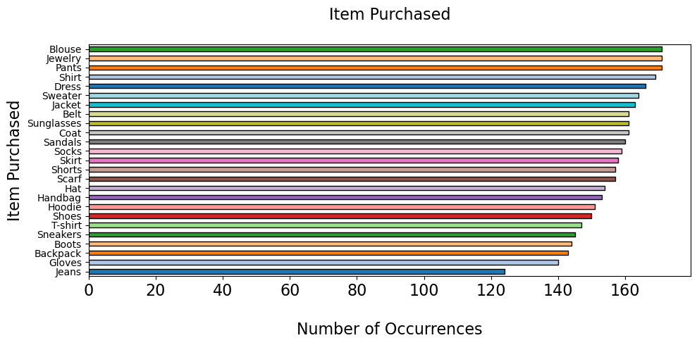
    


```python
data["Location"].value_counts()
```


    Location
    Montana           96
    California        95
    Idaho             93
    Illinois          92
    Alabama           89
    Minnesota         88
    Nebraska          87
    New York          87
    Nevada            87
    Maryland          86
    Delaware          86
    Vermont           85
    Louisiana         84
    North Dakota      83
    Missouri          81
    West Virginia     81
    New Mexico        81
    Mississippi       80
    Indiana           79
    Georgia           79
    Kentucky          79
    Arkansas          79
    North Carolina    78
    Connecticut       78
    Virginia          77
    Ohio              77
    Tennessee         77
    Texas             77
    Maine             77
    South Carolina    76
    Colorado          75
    Oklahoma          75
    Wisconsin         75
    Oregon            74
    Pennsylvania      74
    Washington        73
    Michigan          73
    Alaska            72
    Massachusetts     72
    Wyoming           71
    Utah              71
    New Hampshire     71
    South Dakota      70
    Iowa              69
    Florida           68
    New Jersey        67
    Hawaii            65
    Arizona           65
    Kansas            63
    Rhode Island      63
    Name: count, dtype: int64


```python
plt.figure(figsize = (10, 5))
data["Location"].value_counts()[:10].sort_values(ascending = False).plot(kind = 'bar', color = sns.color_palette('inferno'), edgecolor = 'black')
plt.xlabel('Location', weight = "bold", color = "#D71313", fontsize = 14, labelpad = 20)
plt.ylabel('\nNumber of Occurrences', weight = "bold", color = "#D71313", fontsize = 14, labelpad = 20);
plt.xticks(rotation = 90, ha = 'center', fontsize = 16)
plt.tight_layout()
plt.show()
```


    
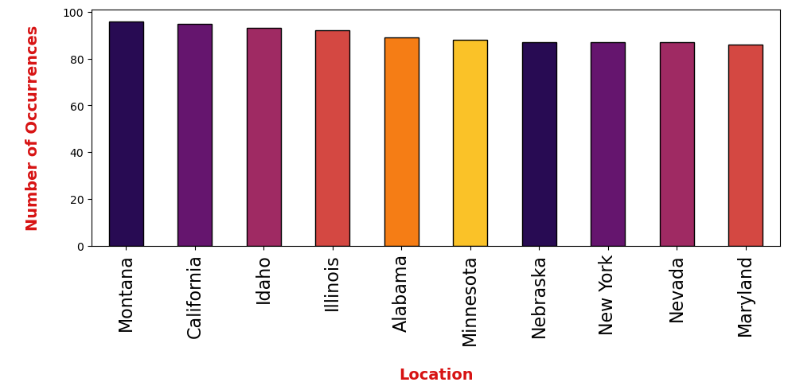
    


```python
data["Size"].value_counts()
```


    Size
    M     1755
    L     1053
    S      663
    XL     429
    Name: count, dtype: int64


```python
plt.figure(figsize = (10, 5))
ax = data["Size"].value_counts().plot(kind = 'bar', rot = 0)
ax.set_xticklabels(('Medium', 'Large', 'Small', 'Extra Large'))

for p in ax.patches:
    ax.annotate(int(p.get_height()), (p.get_x() + 0.25, p.get_height() + 1), ha = 'center', va = 'bottom', color = 'black')
    ax.tick_params(axis = 'both', labelsize = 15)
plt.xlabel('Size', weight = "bold", color = "#D71313", fontsize = 14, labelpad = 20)
plt.ylabel('Number of Occurrences', weight = "bold", color = "#D71313", fontsize = 14, labelpad = 20);
```


    
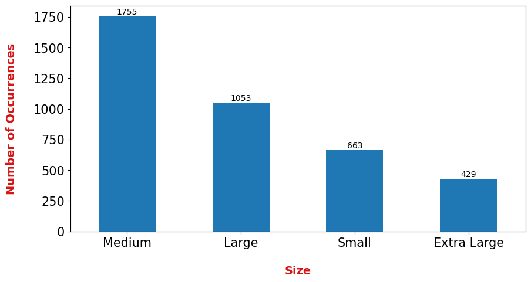
    


```python
plt.figure(figsize = (10, 5))

counts = data["Size"].value_counts()
explode = (0, 0.0, 0.0, 0.1)

counts.plot(kind = 'pie', fontsize = 12, explode = explode, autopct = '%1.1f%%')
plt.xlabel('Size', weight = "bold", color = "#2F0F5D", fontsize = 14, labelpad = 20)
plt.axis('equal')
plt.legend(labels = counts.index, loc = "best")
plt.show()
```


    
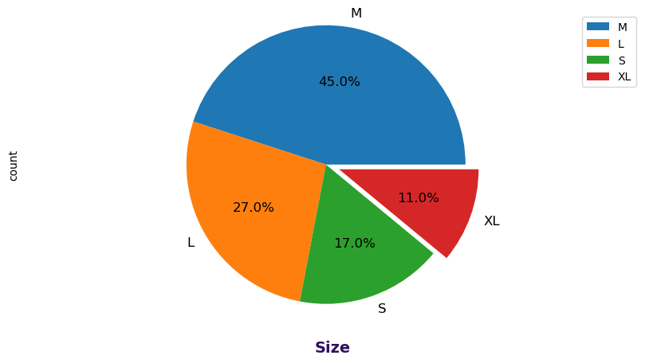
    


```python
data["Color"].value_counts()
```


    Color
    Olive        177
    Yellow       174
    Silver       173
    Teal         172
    Green        169
    Black        167
    Cyan         166
    Violet       166
    Gray         159
    Maroon       158
    Orange       154
    Charcoal     153
    Pink         153
    Magenta      152
    Blue         152
    Purple       151
    Peach        149
    Red          148
    Beige        147
    Indigo       147
    Lavender     147
    Turquoise    145
    White        142
    Brown        141
    Gold         138
    Name: count, dtype: int64


```python
plt.figure(figsize = (10, 5))
data["Color"].value_counts()[:10].sort_values(ascending = True).plot(kind = 'barh', color = sns.color_palette('tab20'), edgecolor = 'black')
plt.xlabel('Color', weight = "bold", color = "#D71313", fontsize = 14, labelpad = 20)
plt.ylabel('\nNumber of Occurrences', weight = "bold", color = "#D71313", fontsize = 14, labelpad = 20);
plt.xticks(rotation = 0, ha = 'center', fontsize = 16)
plt.tight_layout()
plt.show()
```


    
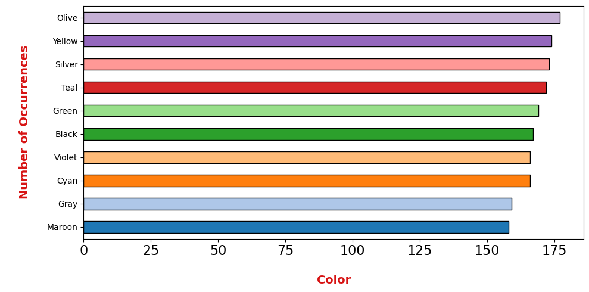
    


```python
data["Season"].value_counts()
```


    Season
    Spring    999
    Fall      975
    Winter    971
    Summer    955
    Name: count, dtype: int64


```python
plt.figure(figsize = (10, 5))
ax = data["Season"].value_counts().plot(kind = 'bar', color='Green', rot = 0)
ax.set_xticklabels(('Spring', 'Fall', 'Winter', 'Summer'))

for p in ax.patches:
    ax.annotate(int(p.get_height()), (p.get_x() + 0.25, p.get_height() + 1), ha = 'center', va = 'bottom', color = 'black')
    ax.tick_params(axis = 'both', labelsize = 15)
plt.xlabel('Season', weight = "bold", color = "#D71313", fontsize = 14, labelpad = 20)
plt.ylabel('Number of Occurrences', weight = "bold", color = "#D71313", fontsize = 14, labelpad = 20);
```


    
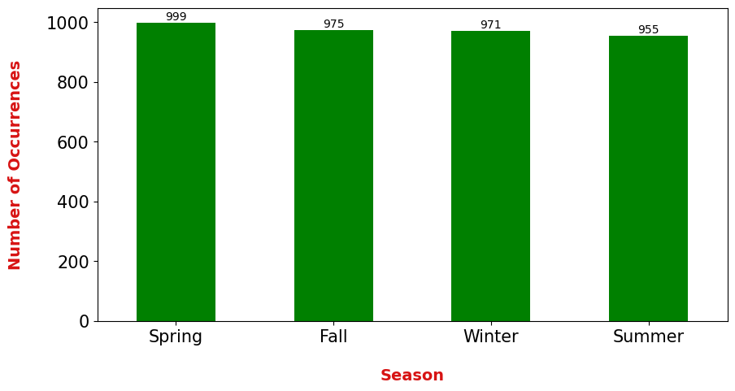
    


```python
plt.figure(figsize = (10, 5))

counts = data["Season"].value_counts()
explode = (0, 0, 0.1, 0)

counts.plot(kind = 'pie', fontsize = 12, explode = explode, autopct = '%1.1f%%')
plt.xlabel('Size', weight = "bold", color = "#2F0F5D", fontsize = 14, labelpad = 20)
plt.axis('equal')
plt.legend(labels = counts.index, loc = "best")
plt.show()
```


    
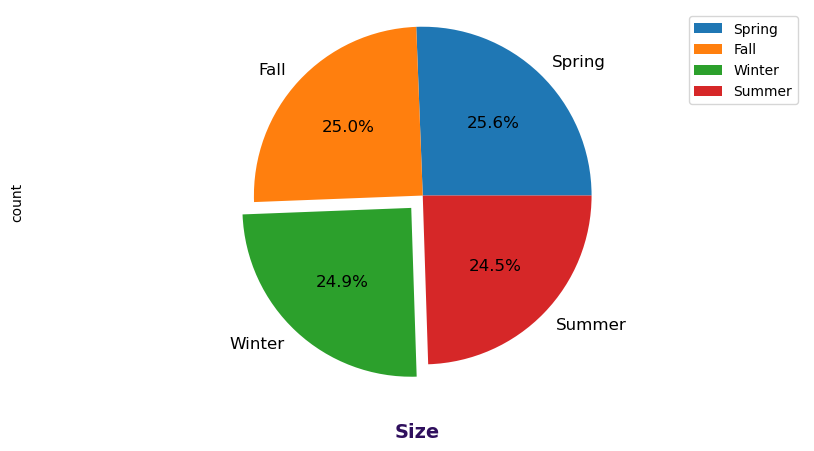
    


```python
data["Subscription Status"].value_counts()
```


    Subscription Status
    No     2847
    Yes    1053
    Name: count, dtype: int64


```python
plt.figure(figsize = (10, 5))
ax = data["Subscription Status"].value_counts().plot(kind = 'bar', rot = 0)
ax.set_xticklabels(('No', 'Yes'))

for p in ax.patches:
    ax.annotate(int(p.get_height()), (p.get_x() + 0.25, p.get_height() + 1), ha = 'center', va = 'bottom', color = 'black')
    ax.tick_params(axis = 'both', labelsize = 15)
plt.xlabel('Subscription Status', weight = "bold", color = "#D71313", fontsize = 14, labelpad = 20)
plt.ylabel('Number of Occurrences', weight = "bold", color = "#D71313", fontsize = 14, labelpad = 20);
```


    
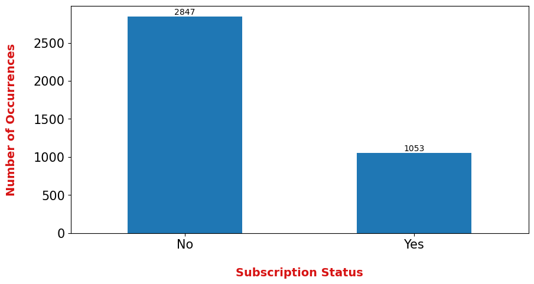
    


```python
plt.figure(figsize = (10, 5))

counts = data["Subscription Status"].value_counts()
explode = (0, 0.1)

counts.plot(kind = 'pie', fontsize = 12, explode = explode, autopct = '%1.1f%%')
plt.xlabel('Size', weight = "bold", color = "#2F0F5D", fontsize = 14, labelpad = 20)
plt.axis('equal')
plt.legend(labels = counts.index, loc = "best")
plt.show()
```


    
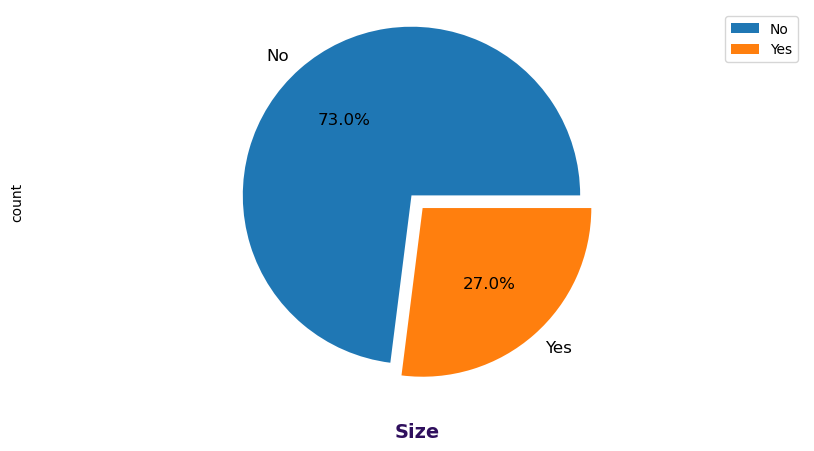
    


```python
data["Payment Method"].value_counts()
```


    Payment Method
    PayPal           677
    Credit Card      671
    Cash             670
    Debit Card       636
    Venmo            634
    Bank Transfer    612
    Name: count, dtype: int64


```python
plt.figure(figsize = (10, 5))
ax = data["Payment Method"].value_counts().plot(kind = 'bar' , rot = 0)
ax.set_xticklabels(('Credit Card', 'Venmo', 'Cash', 'Paypal', 'Debit Card', 'Bank Transfer'))

for p in ax.patches:
    ax.annotate(int(p.get_height()), (p.get_x() + 0.25, p.get_height() + 1), ha = 'center', va = 'bottom', color = 'black')
    ax.tick_params(axis = 'both', labelsize = 15)
plt.xlabel('Payment Method', weight = "bold", color = "#D71313", fontsize = 14, labelpad = 20)
plt.ylabel('Number of Occurrences', weight = "bold", color = "#D71313", fontsize = 14, labelpad = 20);
```


    

    


```python
plt.figure(figsize = (10, 5))

counts = data["Payment Method"].value_counts()
explode = (0.06, 0, 0, 0, 0.0, 0.0)

counts.plot(kind = 'pie', fontsize = 12, explode = explode, autopct = '%1.1f%%')
plt.xlabel('Size', weight = "bold", color = "#2F0F5D", fontsize = 14, labelpad = 20)
plt.axis('equal')
plt.legend(labels = counts.index, loc = "best")
plt.show()
```


    
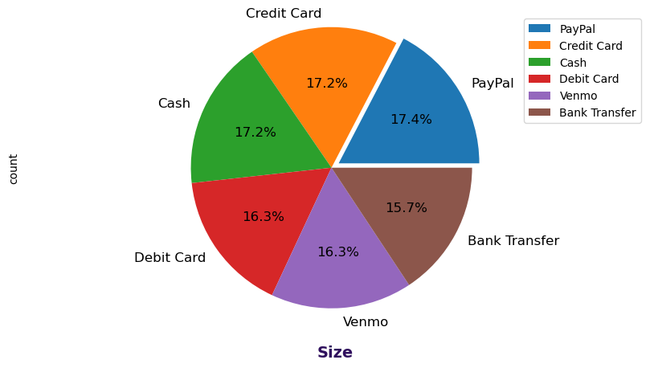
    


```python
data["Shipping Type"].value_counts()
```


    Shipping Type
    Free Shipping     675
    Standard          654
    Store Pickup      650
    Next Day Air      648
    Express           646
    2-Day Shipping    627
    Name: count, dtype: int64


```python
plt.figure(figsize = (10, 5))
ax = data["Shipping Type"].value_counts().plot(kind = 'bar', color = 'Darkblue', rot = 0)
ax.set_xticklabels(('Free Shipping', 'Standard', 'Store Pickup', 'Next Day Air', 'Express', '2-Day Shipping'))

for p in ax.patches:
    ax.annotate(int(p.get_height()), (p.get_x() + 0.25, p.get_height() + 1), ha = 'center', va = 'bottom', color = 'black')
    ax.tick_params(axis = 'both', labelsize = 15)
plt.xlabel('Shipping Type', weight = "bold", color = "#D71313", fontsize = 14, labelpad = 20)
plt.ylabel('Number of Occurrences', weight = "bold", color = "#D71313", fontsize = 14, labelpad = 20);
```


    
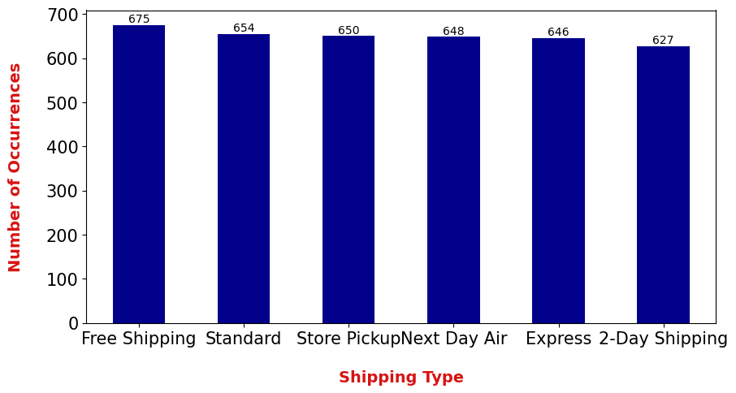
    


```python
plt.figure(figsize = (10, 5))

counts = data["Shipping Type"].value_counts()
explode = (0.06, 0, 0, 0, 0.0, 0.0)

counts.plot(kind = 'pie', fontsize = 12, explode = explode, autopct = '%1.1f%%')
plt.xlabel('Size', weight = "bold", color = "#2F0F5D", fontsize = 14, labelpad = 20)
plt.axis('equal')
plt.legend(labels = counts.index, loc = "best")
plt.show()
```


    
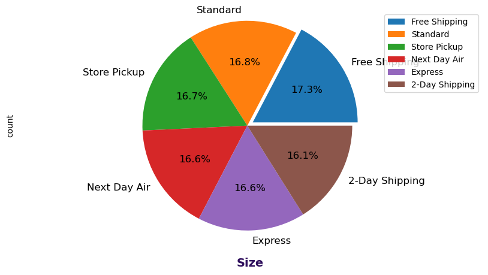
    


```python
data["Payment Method"].value_counts()
```


    Payment Method
    PayPal           677
    Credit Card      671
    Cash             670
    Debit Card       636
    Venmo            634
    Bank Transfer    612
    Name: count, dtype: int64


```python
plt.figure(figsize = (10, 5))
ax = data["Payment Method"].value_counts().plot(kind = 'bar', rot = 0)
ax.set_xticklabels(('PayPal', 'Credit Card', 'Cash', 'Debit Card', 'Venmo', 'Bank Transfer'))

for p in ax.patches:
    ax.annotate(int(p.get_height()), (p.get_x() + 0.25, p.get_height() + 1), ha = 'center', va = 'bottom', color = 'black')
    ax.tick_params(axis = 'both', labelsize = 15)
plt.xlabel('Payment Method', weight = "bold", color = "#D71313", fontsize = 14, labelpad = 20)
plt.ylabel('Number of Occurrences', weight = "bold", color = "#D71313", fontsize = 14, labelpad = 20);
```


    
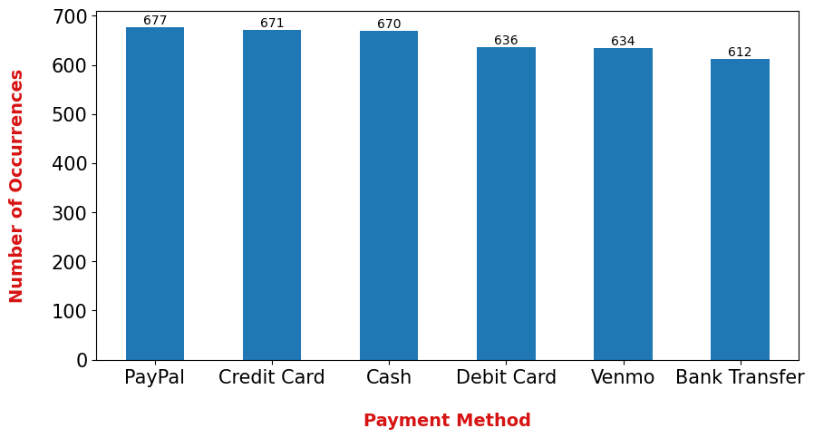
    


```python
plt.figure(figsize = (10, 5))

counts = data["Payment Method"].value_counts()
explode = (0.06, 0, 0, 0, 0.0, 0.0)

counts.plot(kind = 'pie', fontsize = 12, explode = explode, autopct = '%1.1f%%')
plt.xlabel('Size', weight = "bold", color = "#2F0F5D", fontsize = 14, labelpad = 20)
plt.axis('equal')
plt.legend(labels = counts.index, loc = "best")
plt.show()
```


    

    


<div style="padding:10px;
            color:#87CEEB;
            margin:10px;
            font-size:130%;
            display:fill;
            border-radius:5px;
            border-style: solid;
            border-color: #87CEEB;
            background-color:#000000;
            overflow:hidden;
            font-weight:400"><b>What is the average age of customers in the dataset ?</b>
</div>


```python
average_age = data['Age'].mean()
print("Average Age:", average_age)
```

    Average Age: 44.06846153846154
    

<div style="padding:10px;
            color:#87CEEB;
            margin:10px;
            font-size:130%;
            display:fill;
            border-radius:5px;
            border-style: solid;
            border-color: #87CEEB;
            background-color:#000000;
            overflow:hidden;
            font-weight:400"><b>What is the most common item purchased ?</b>
</div>


```python
most_common_item = data['Item Purchased'].mode()[0]
print("Most Common Item Purchased:", most_common_item)
```

    Most Common Item Purchased: Blouse
    

<div style="padding:10px;
            color:#87CEEB;
            margin:10px;
            font-size:130%;
            display:fill;
            border-radius:5px;
            border-style: solid;
            border-color: #87CEEB;
            background-color:#000000;
            overflow:hidden;
            font-weight:400"><b>What is the total purchase amount for each category ?</b>
</div>


```python
total_purchase_by_category = data.groupby('Category')['Purchase Amount (USD)'].sum()
print("Total Purchase Amount by Category:")
print(total_purchase_by_category)
```

    Total Purchase Amount by Category:
    Category
    Accessories     74200
    Clothing       104264
    Footwear        36093
    Outerwear       18524
    Name: Purchase Amount (USD), dtype: int64
    

<div style="padding:10px;
            color:#87CEEB;
            margin:10px;
            font-size:130%;
            display:fill;
            border-radius:5px;
            border-style: solid;
            border-color: #87CEEB;
            background-color:#000000;
            overflow:hidden;
            font-weight:400"><b>What is the average review rating for male customers and female customers separately ?</b>
</div>


```python
average_rating_male = data[data['Gender'] == 'Male']['Review Rating'].mean()
average_rating_female = data[data['Gender'] == 'Female']['Review Rating'].mean()
print("Average Review Rating for Male Customers:", average_rating_male)
print("Average Review Rating for Female Customers:", average_rating_female)
```

    Average Review Rating for Male Customers: 3.7539592760180995
    Average Review Rating for Female Customers: 3.741426282051282
    

<div style="padding:10px;
            color:#87CEEB;
            margin:10px;
            font-size:130%;
            display:fill;
            border-radius:5px;
            border-style: solid;
            border-color: #87CEEB;
            background-color:#000000;
            overflow:hidden;
            font-weight:400"><b>What is the most common payment method used by customers ?</b>
</div>


```python
most_common_payment_method = data['Payment Method'].mode()[0]
print("Most Common Payment Method:", most_common_payment_method)
```

    Most Common Payment Method: PayPal
    

<div style="padding:10px;
            color:#87CEEB;
            margin:10px;
            font-size:130%;
            display:fill;
            border-radius:5px;
            border-style: solid;
            border-color: #87CEEB;
            background-color:#000000;
            overflow:hidden;
            font-weight:400"><b>What is the median purchase amount (USD) ?</b>
</div>


```python
median_purchase_amount = data['Purchase Amount (USD)'].median()
print("Median Purchase Amount (USD):", median_purchase_amount)
```

    Median Purchase Amount (USD): 60.0
    

<div style="padding:10px;
            color:#87CEEB;
            margin:10px;
            font-size:130%;
            display:fill;
            border-radius:5px;
            border-style: solid;
            border-color: #87CEEB;
            background-color:#000000;
            overflow:hidden;
            font-weight:400"><b>How many customers have opted for the Subscription and How many did not subscribed ?</b></div>


```python
subscription_count = data[data['Subscription Status'] == 'Yes']['Customer ID'].count()
not_subscribed_count = data[data['Subscription Status'] == 'No']['Customer ID'].count()
print("Number of Customers with Subscription: ", subscription_count)
print("Number of Customers Not subscribed : ", not_subscribed_count)
```

    Number of Customers with Subscription:  1053
    Number of Customers Not subscribed :  2847
    

<div style="padding:10px;
            color:#87CEEB;
            margin:10px;
            font-size:130%;
            display:fill;
            border-radius:5px;
            border-style: solid;
            border-color: #87CEEB;
            background-color:#000000;
            overflow:hidden;
            font-weight:400"><b>What is the average purchase amount for customers with a subscription status of 'Yes' and 'No' ?</b></div>


```python
avg_purchase_subscription_yes = data[data['Subscription Status'] == 'Yes']['Purchase Amount (USD)'].mean()
avg_purchase_subscription_no = data[data['Subscription Status'] == 'No']['Purchase Amount (USD)'].mean()
print("Average Purchase Amount for Subscription 'Yes':", avg_purchase_subscription_yes)
print("Average Purchase Amount for Subscription 'No':", avg_purchase_subscription_no)
```

    Average Purchase Amount for Subscription 'Yes': 59.49192782526116
    Average Purchase Amount for Subscription 'No': 59.865121180189675
    

<div style="padding:10px;
            color:#87CEEB;
            margin:10px;
            font-size:130%;
            display:fill;
            border-radius:5px;
            border-style: solid;
            border-color: #87CEEB;
            background-color:#000000;
            overflow:hidden;
            font-weight:400"><b>What is the most common season for purchases ?</b></div>


```python
most_common_season = data['Season'].mode()[0]
print("Most Common Season for Purchases:", most_common_season)
```

    Most Common Season for Purchases: Spring
    

<div style="padding:10px;
            color:#87CEEB;
            margin:10px;
            font-size:130%;
            display:fill;
            border-radius:5px;
            border-style: solid;
            border-color: #87CEEB;
            background-color:#000000;
            overflow:hidden;
            font-weight:400"><b>What is the total purchase amount for each gender ?</b>
</div>


```python
total_purchase_by_gender = data.groupby('Gender')['Purchase Amount (USD)'].sum()
print("Total Purchase Amount by Gender:")
print(total_purchase_by_gender)
```

    Total Purchase Amount by Gender:
    Gender
    Female     75191
    Male      157890
    Name: Purchase Amount (USD), dtype: int64
    

<div style="padding:10px;
            color:#87CEEB;
            margin:10px;
            font-size:130%;
            display:fill;
            border-radius:5px;
            border-style: solid;
            border-color: #87CEEB;
            background-color:#000000;
            overflow:hidden;
            font-weight:400"><b>What is the average age of customers who made purchases in the Summer season ?</b>
</div>


```python
average_age_summer = data[data['Season'] == 'Summer']['Age'].mean()
print("Average Age of Customers in the Summer Season:", average_age_summer)
```

    Average Age of Customers in the Summer Season: 43.973821989528794
    

<div style="padding:10px;
            color:#87CEEB;
            margin:10px;
            font-size:130%;
            display:fill;
            border-radius:5px;
            border-style: solid;
            border-color: #87CEEB;
            background-color:#000000;
            overflow:hidden;
            font-weight:400"><b>How many customers used a promo code for their purchase ?</b></div>


```python
promo_code_count = data[data['Promo Code Used'] == 'Yes']['Customer ID'].count()
print("Number of Customers who used Promo Code:", promo_code_count)
```

    Number of Customers who used Promo Code: 1677
    

<div style="padding:10px;
            color:#87CEEB;
            margin:10px;
            font-size:130%;
            display:fill;
            border-radius:5px;
            border-style: solid;
            border-color: #87CEEB;
            background-color:#000000;
            overflow:hidden;
            font-weight:400"><b>What is the maximum and minimum review rating in the dataset ?</b></div>


```python
max_review_rating = data['Review Rating'].max()
min_review_rating = data['Review Rating'].min()
print("Maximum Review Rating:", max_review_rating)
print("Minimum Review Rating:", min_review_rating)
```

    Maximum Review Rating: 5.0
    Minimum Review Rating: 2.5
    

<div style="padding:10px;
            color:#87CEEB;
            margin:10px;
            font-size:130%;
            display:fill;
            border-radius:5px;
            border-style: solid;
            border-color: #87CEEB;
            background-color:#000000;
            overflow:hidden;
            font-weight:400"><b>What is the most common shipping type for customers with a review rating above 4 ?</b>
</div>


```python
common_shipping_high_rating = data[data['Review Rating'] > 4]['Shipping Type'].mode()[0]
print("Most Common Shipping Type for High Review Ratings:", common_shipping_high_rating)
```

    Most Common Shipping Type for High Review Ratings: Standard
    

<div style="padding:10px;
            color:#87CEEB;
            margin:10px;
            font-size:130%;
            display:fill;
            border-radius:5px;
            border-style: solid;
            border-color: #87CEEB;
            background-color:#000000;
            overflow:hidden;
            font-weight:400"><b>How many customers have made more than 30 previous purchases ?</b>
</div>


```python
customers_above_30_previous_purchases = data[data['Previous Purchases'] > 30]['Customer ID'].count()
print("Number of Customers with more than 30 Previous Purchases:", customers_above_30_previous_purchases)
```

    Number of Customers with more than 30 Previous Purchases: 1549
    

<div style="padding:10px;
            color:#87CEEB;
            margin:10px;
            font-size:130%;
            display:fill;
            border-radius:5px;
            border-style: solid;
            border-color: #87CEEB;
            background-color:#000000;
            overflow:hidden;
            font-weight:400"><b>What is the average purchase amount for customers who have made more than 30 previous purchases ?</b>
</div>


```python
avg_purchase_above_30_previous_purchases = data[data['Previous Purchases'] > 30]['Purchase Amount (USD)'].mean()
print("Average Purchase Amount for Customers with more than 30 Previous Purchases:", avg_purchase_above_30_previous_purchases)
```

    Average Purchase Amount for Customers with more than 30 Previous Purchases: 60.02840542285345
    

<div style="padding:10px;
            color:#87CEEB;
            margin:10px;
            font-size:130%;
            display:fill;
            border-radius:5px;
            border-style: solid;
            border-color: #87CEEB;
            background-color:#000000;
            overflow:hidden;
            font-weight:400"><b>What is the most common payment method for customers who shop in the Winter season ?</b>
</div>


```python
total_purchase_free_shipping = data[data['Shipping Type'] == 'Free Shipping']['Purchase Amount (USD)'].sum()
print("Total Purchase Amount for 'Free Shipping' Shipping Type:", total_purchase_free_shipping)
```

    Total Purchase Amount for 'Free Shipping' Shipping Type: 40777
    

<div style="padding:10px;
            color:#87CEEB;
            margin:10px;
            font-size:130%;
            display:fill;
            border-radius:5px;
            border-style: solid;
            border-color: #87CEEB;
            background-color:#000000;
            overflow:hidden;
            font-weight:400"><b>What is the total purchase amount for customers with a 'Free Shipping' shipping type ?</b></div>


```python
total_purchase_free_shipping = data[data['Shipping Type'] == 'Free Shipping']['Purchase Amount (USD)'].sum()
print("Total Purchase Amount for 'Free Shipping' Shipping Type:", total_purchase_free_shipping)
```

    Total Purchase Amount for 'Free Shipping' Shipping Type: 40777
    

<div style="padding:10px;
            color:#87CEEB;
            margin:10px;
            font-size:130%;
            display:fill;
            border-radius:5px;
            border-style: solid;
            border-color: #87CEEB;
            background-color:#000000;
            overflow:hidden;
            font-weight:400"><b>What is the average purchase amount for customers who used a discount ?</b></div>


```python
avg_purchase_with_discount = data[data['Discount Applied'] == 'Yes']['Purchase Amount (USD)'].mean()
print("Average Purchase Amount for Customers with Discount Applied:", avg_purchase_with_discount)
```

    Average Purchase Amount for Customers with Discount Applied: 59.27906976744186
    

<div style="padding:10px;
            color:#87CEEB;
            margin:10px;
            font-size:130%;
            display:fill;
            border-radius:5px;
            border-style: solid;
            border-color: #87CEEB;
            background-color:#000000;
            overflow:hidden;
            font-weight:400"><b>What is the most common category of items purchased by female customers with a review rating below 3 ?</b>
</div>


```python
common_category_low_rating_female = data[(data['Gender'] == 'Female') & (data['Review Rating'] < 3)]['Category'].mode()[0]
print("Most Common Category for Low Review Rating Female Customers:", common_category_low_rating_female)
```

    Most Common Category for Low Review Rating Female Customers: Clothing
    

<div style="padding:10px;
            color:#87CEEB;
            margin:10px;
            font-size:130%;
            display:fill;
            border-radius:5px;
            border-style: solid;
            border-color: #87CEEB;
            background-color:#000000;
            overflow:hidden;
            font-weight:400"><b>What is the average age of customers who made purchases with a review rating above 4 and used a promo code?</b></div>


```python
average_age_high_rating_promo = data[(data['Review Rating'] > 4) & (data['Promo Code Used'] == 'Yes')]['Age'].mean()
print("Average Age of Customers with High Review Ratings and Promo Code Used:", average_age_high_rating_promo)
```

    Average Age of Customers with High Review Ratings and Promo Code Used: 43.9872
    

<div style="padding:10px;
            color:#87CEEB;
            margin:10px;
            font-size:130%;
            display:fill;
            border-radius:5px;
            border-style: solid;
            border-color: #87CEEB;
            background-color:#000000;
            overflow:hidden;
            font-weight:400"><b>What is the total purchase amount for customers in each location ?</b></div>


```python
total_purchase_by_location = data.groupby('Location')['Purchase Amount (USD)'].sum()
print("Total Purchase Amount by Location:")
print(total_purchase_by_location)
```

    Total Purchase Amount by Location:
    Location
    Alabama           5261
    Alaska            4867
    Arizona           4326
    Arkansas          4828
    California        5605
    Colorado          4222
    Connecticut       4226
    Delaware          4758
    Florida           3798
    Georgia           4645
    Hawaii            3752
    Idaho             5587
    Illinois          5617
    Indiana           4655
    Iowa              4201
    Kansas            3437
    Kentucky          4402
    Louisiana         4848
    Maine             4388
    Maryland          4795
    Massachusetts     4384
    Michigan          4533
    Minnesota         4977
    Mississippi       4883
    Missouri          4691
    Montana           5784
    Nebraska          5172
    Nevada            5514
    New Hampshire     4219
    New Jersey        3802
    New Mexico        5014
    New York          5257
    North Carolina    4742
    North Dakota      5220
    Ohio              4649
    Oklahoma          4376
    Oregon            4243
    Pennsylvania      4926
    Rhode Island      3871
    South Carolina    4439
    South Dakota      4236
    Tennessee         4772
    Texas             4712
    Utah              4443
    Vermont           4860
    Virginia          4842
    Washington        4623
    West Virginia     5174
    Wisconsin         4196
    Wyoming           4309
    Name: Purchase Amount (USD), dtype: int64
    

<div style="padding:10px;
            color:#87CEEB;
            margin:10px;
            font-size:130%;
            display:fill;
            border-radius:5px;
            border-style: solid;
            border-color: #87CEEB;
            background-color:#000000;
            overflow:hidden;
            font-weight:400"><b>What is the average purchase amount for customers who have a subscription and used Venmo as the payment method ?</b></div>


```python
avg_purchase_subscription_venmo = data[(data['Subscription Status'] == 'Yes') & (data['Payment Method'] == 'Venmo')]['Purchase Amount (USD)'].mean()
print("Average Purchase Amount for Customers with Subscription and Venmo Payment Method:", avg_purchase_subscription_venmo)
```

    Average Purchase Amount for Customers with Subscription and Venmo Payment Method: 57.51149425287356
    

<div style="padding:10px;
            color:#87CEEB;
            margin:10px;
            font-size:130%;
            display:fill;
            border-radius:5px;
            border-style: solid;
            border-color: #87CEEB;
            background-color:#000000;
            overflow:hidden;
            font-weight:400"><b>What is the frequency distribution of the 'Frequency of Purchases' column ?</b></div>


```python
purchase_frequency_distribution = data['Frequency of Purchases'].value_counts()
print("Frequency Distribution of Purchase Frequency:")
print(purchase_frequency_distribution)
```

    Frequency Distribution of Purchase Frequency:
    Frequency of Purchases
    Every 3 Months    584
    Annually          572
    Quarterly         563
    Monthly           553
    Bi-Weekly         547
    Fortnightly       542
    Weekly            539
    Name: count, dtype: int64
    

<div style="padding:10px;
            color:#87CEEB;
            margin:10px;
            font-size:130%;
            display:fill;
            border-radius:5px;
            border-style: solid;
            border-color: #87CEEB;
            background-color:#000000;
            overflow:hidden;
            font-weight:400"><b>What is the average purchase amount for each color of items ?</b></div>


```python
avg_purchase_by_color = data.groupby('Color')['Purchase Amount (USD)'].mean()
print("Average Purchase Amount by Color:")
print(avg_purchase_by_color)
```

    Average Purchase Amount by Color:
    Color
    Beige        60.414966
    Black        58.401198
    Blue         56.953947
    Brown        59.063830
    Charcoal     60.633987
    Cyan         61.891566
    Gold         61.007246
    Gray         62.490566
    Green        65.704142
    Indigo       56.251701
    Lavender     59.129252
    Magenta      57.131579
    Maroon       59.525316
    Olive        58.146893
    Orange       60.889610
    Peach        59.187919
    Pink         60.588235
    Purple       60.013245
    Red          59.317568
    Silver       56.832370
    Teal         60.808140
    Turquoise    55.613793
    Violet       61.716867
    White        62.640845
    Yellow       59.241379
    Name: Purchase Amount (USD), dtype: float64
    

<div style="padding:10px;
            color:#87CEEB;
            margin:10px;
            font-size:130%;
            display:fill;
            border-radius:5px;
            border-style: solid;
            border-color: #87CEEB;
            background-color:#000000;
            overflow:hidden;
            font-weight:400"><b>KDE plot for Purchase Amount by Season</b>
</div>


```python
plt.figure(figsize=(10, 5))
sns.kdeplot(data , x = 'Purchase Amount (USD)', hue = 'Season', common_norm = False, fill = True, palette = 'Set1')
plt.title('KDE Plot of Purchase Amount by Season')
plt.xlabel('Purchase Amount in USD')
plt.show()
```


    
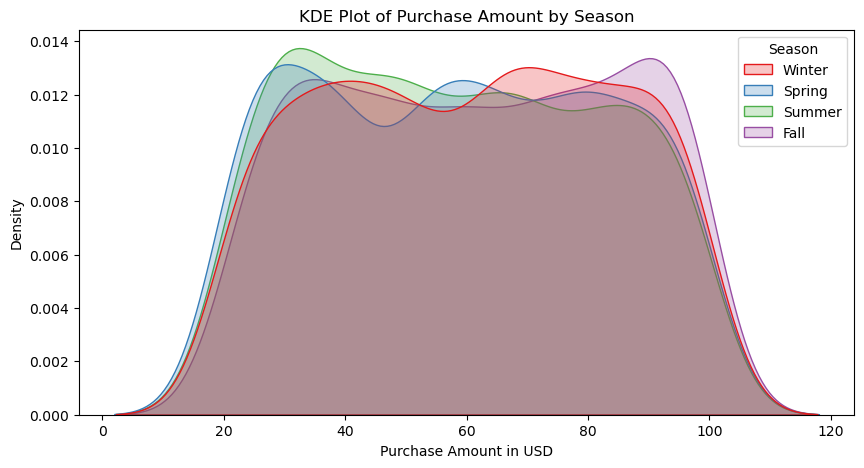
    


<div style="padding:10px;
            color:#87CEEB;
            margin:10px;
            font-size:130%;
            display:fill;
            border-radius:5px;
            border-style: solid;
            border-color: #87CEEB;
            background-color:#000000;
            overflow:hidden;
            font-weight:400"><b>What is the most common payment method for customers who purchased items in the Fall season ?</b></div>


```python
common_payment_fall = data[data['Season'] == 'Fall']['Payment Method'].mode()[0]
print("Most Common Payment Method for Fall Season Purchases:", common_payment_fall)
```

    Most Common Payment Method for Fall Season Purchases: Cash
    

<div style="padding:10px;
            color:#87CEEB;
            margin:10px;
            font-size:130%;
            display:fill;
            border-radius:5px;
            border-style: solid;
            border-color: #87CEEB;
            background-color:#000000;
            overflow:hidden;
            font-weight:400"><b>How many customers have made a purchase in each category ?</b></div>


```python
purchase_count_by_category = data['Category'].value_counts()
print("Purchase Count by Category:")
print(purchase_count_by_category)
```

    Purchase Count by Category:
    Category
    Clothing       1737
    Accessories    1240
    Footwear        599
    Outerwear       324
    Name: count, dtype: int64
    

<div style="padding:10px;
            color:#87CEEB;
            margin:10px;
            font-size:130%;
            display:fill;
            border-radius:5px;
            border-style: solid;
            border-color: #87CEEB;
            background-color:#000000;
            overflow:hidden;
            font-weight:400"><b>What is the total purchase amount for each size of clothing items (XL, L, M, S) ?</b></div>


```python
total_purchase_by_size = data[data['Category'] == 'Clothing'].groupby('Size')['Purchase Amount (USD)'].sum()
print("Total Purchase Amount by Size for Clothing Items:")
print(total_purchase_by_size)
```

    Total Purchase Amount by Size for Clothing Items:
    Size
    L     27864
    M     47041
    S     17416
    XL    11943
    Name: Purchase Amount (USD), dtype: int64
    

<div style="padding:10px;
            color:#87CEEB;
            margin:10px;
            font-size:130%;
            display:fill;
            border-radius:5px;
            border-style: solid;
            border-color: #87CEEB;
            background-color:#000000;
            overflow:hidden;
            font-weight:400"><b>What is the most common item purchased by customers in Louisiana with a review rating of 4 or higher ?</b></div>


```python
common_item_high_rating_louisiana = data[(data['Location'] == 'Louisiana') & (data['Review Rating'] >= 4)]['Item Purchased'].mode()[0]
print("Most Common Item Purchased by High-Rating Customers in Louisiana:", common_item_high_rating_louisiana)
```

    Most Common Item Purchased by High-Rating Customers in Louisiana: Sweater
    

<div style="padding:10px;
            color:#87CEEB;
            margin:10px;
            font-size:130%;
            display:fill;
            border-radius:5px;
            border-style: solid;
            border-color: #87CEEB;
            background-color:#000000;
            overflow:hidden;
            font-weight:400"><b>What is the most common category of items purchased by male customers in the Winter season with a review rating below 3 ?</b></div>


```python
common_category_low_rating_male_winter = data[(data['Gender'] == 'Male') & (data['Season'] == 'Winter') & (data['Review Rating'] < 3)]['Category'].mode()[0]
print("Most Common Category for Low-Rating Male Customers in Winter Season:", common_category_low_rating_male_winter)
```

    Most Common Category for Low-Rating Male Customers in Winter Season: Clothing
    

<div style="padding:10px;
            color:#87CEEB;
            margin:10px;
            font-size:130%;
            display:fill;
            border-radius:5px;
            border-style: solid;
            border-color: #87CEEB;
            background-color:#000000;
            overflow:hidden;
            font-weight:400"><b>How many customers have a subscription status of 'Yes' and used a promo code for their purchase ?</b></div>


```python
subscription_promo_count = data[(data['Subscription Status'] == 'Yes') & (data['Promo Code Used'] == 'Yes')]['Customer ID'].count()
print("Number of Customers with Subscription and Promo Code Used: ", subscription_promo_count)
```

    Number of Customers with Subscription and Promo Code Used:  1053
    

<div style="padding:10px;
            color:#87CEEB;
            margin:10px;
            font-size:130%;
            display:fill;
            border-radius:5px;
            border-style: solid;
            border-color: #87CEEB;
            background-color:#000000;
            overflow:hidden;
            font-weight:400"><b> Histogram of Age Distribution </b>
</div>


```python
plt.figure(figsize = (10, 7))
plt.hist(data['Age'], bins = 20, edgecolor = 'k')
plt.title('Age Distribution')
plt.xlabel('Age')
plt.ylabel('Frequency')
plt.show()
```


    
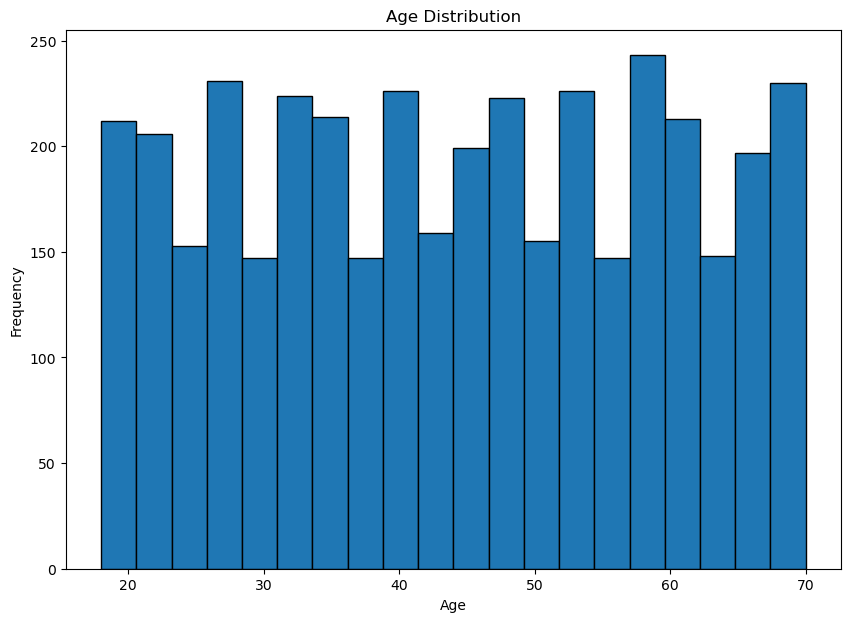
    


<div style="padding:10px;
            color:#87CEEB;
            margin:10px;
            font-size:130%;
            display:fill;
            border-radius:5px;
            border-style: solid;
            border-color: #87CEEB;
            background-color:#000000;
            overflow:hidden;
            font-weight:400"><b> Box Plot of Purchase Amount by Gender </b>
</div>


```python
plt.figure(figsize = (10, 5))
sns.boxplot(data, x='Gender', y='Purchase Amount (USD)')
plt.title('Purchase Amount by Gender')
plt.xlabel('Gender')
plt.ylabel('Purchase Amount (USD)')
plt.show()
```


    
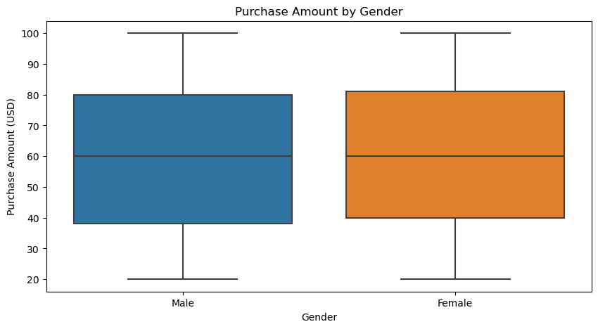
    


<div style="padding:10px;
            color:#87CEEB;
            margin:10px;
            font-size:130%;
            display:fill;
            border-radius:5px;
            border-style: solid;
            border-color: #87CEEB;
            background-color:#000000;
            overflow:hidden;
            font-weight:400"><b> Scatter Plot of Age vs Review rating </b>
</div>


```python
plt.figure(figsize = (10, 5))
plt.scatter(data['Age'], data['Review Rating'], alpha=0.5)
plt.title('Age vs. Review Rating')
plt.xlabel('Age')
plt.ylabel('Review Rating')
plt.show()
```


    
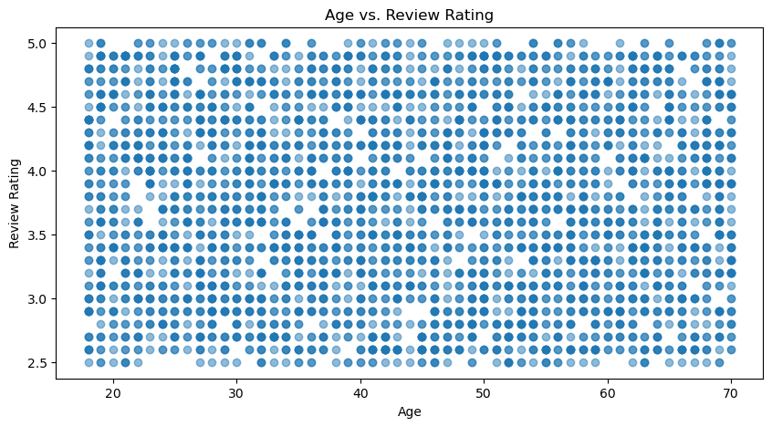
    


<div style="padding:10px;
            color:#87CEEB;
            margin:10px;
            font-size:130%;
            display:fill;
            border-radius:5px;
            border-style: solid;
            border-color: #87CEEB;
            background-color:#000000;
            overflow:hidden;
            font-weight:400"><b> Stacked Bar Chart of Subscription Status by Gender </b>
</div>


```python
subscription_gender_counts = data.groupby(['Gender', 'Subscription Status']).size().unstack()
plt.figure(figsize = (10, 5))
subscription_gender_counts.plot(kind='bar', stacked=True, rot = 0);
plt.title('Subscription Status by Gender')
plt.xlabel('Gender')
plt.ylabel('Count')
plt.show();
```


    <Figure size 1000x500 with 0 Axes>


    
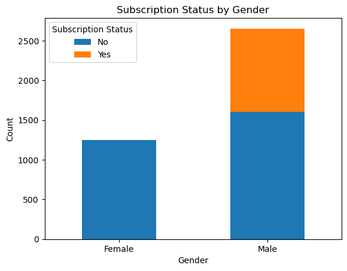
    


<div style="padding:10px;
            color:#87CEEB;
            margin:10px;
            font-size:130%;
            display:fill;
            border-radius:5px;
            border-style: solid;
            border-color: #87CEEB;
            background-color:#000000;
            overflow:hidden;
            font-weight:400"><b> Violin Plot of review rating by Category </b>
</div>


```python
plt.figure(figsize=(10, 5))
sns.violinplot(data, x='Category', y='Review Rating')
plt.title('Review Rating by Category')
plt.xlabel('Category')
plt.ylabel('Review Rating')
plt.xticks(rotation=45)
plt.show()

```


    
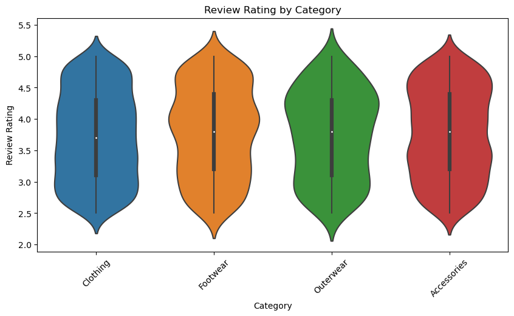
    


<div style="padding:10px;
            color:#87CEEB;
            margin:10px;
            font-size:130%;
            display:fill;
            border-radius:5px;
            border-style: solid;
            border-color: #87CEEB;
            background-color:#000000;
            overflow:hidden;
            font-weight:400"><b> Purchase Amount by Season and Pyament Method</b>
</div>


```python
plt.figure(figsize=(10, 6))
sns.barplot(data, x='Season', y='Purchase Amount (USD)', hue='Payment Method')
plt.title('Purchase Amount by Season and Payment Method')
plt.xlabel('Season')
plt.ylabel('Purchase Amount (USD)')
plt.xticks(rotation = 0)
plt.show()
```


    
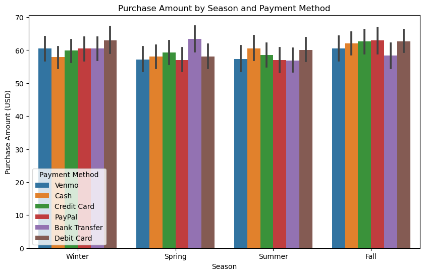
    


<div style="padding:10px;
            color:#87CEEB;
            margin:10px;
            font-size:130%;
            display:fill;
            border-radius:5px;
            border-style: solid;
            border-color: #87CEEB;
            background-color:#000000;
            overflow:hidden;
            font-weight:400"><b> Area Plot of Total Purchase Amount by Category ?</b>
</div>


```python
plt.figure(figsize=(20, 6))
category_purchase_total = data.groupby('Category')['Purchase Amount (USD)'].sum()

category_purchase_total.plot(kind='area')
plt.title('Total Purchase Amount by Category')
plt.xlabel('Category')
plt.ylabel('Total Purchase Amount (USD)')
plt.xticks(rotation=45)
plt.show()
```


    
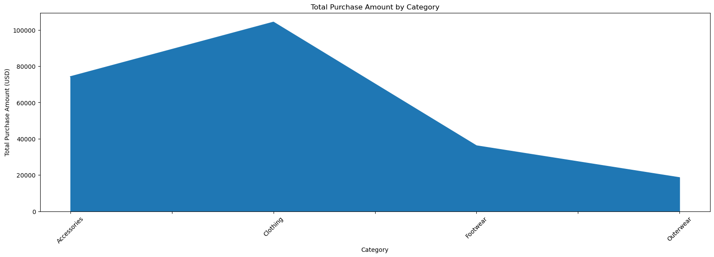
    


<div style="padding:10px;
            color:#87CEEB;
            margin:10px;
            font-size:130%;
            display:fill;
            border-radius:5px;
            border-style: solid;
            border-color: #87CEEB;
            background-color:#000000;
            overflow:hidden;
            font-weight:400"><b> Hexbin Plot of Age vs Purchase Amount?</b>
</div>


```python
plt.hexbin(data['Age'], data['Purchase Amount (USD)'], gridsize=20, cmap='Blues')
plt.title('Hexbin Plot of Age vs. Purchase Amount')
plt.xlabel('Age')
plt.ylabel('Purchase Amount (USD)')
plt.colorbar()
plt.show()
```


    
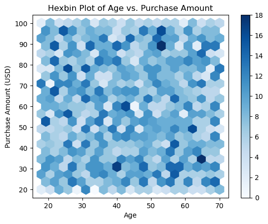
    


<div style="padding:10px;
            color:#87CEEB;
            margin:10px;
            font-size:130%;
            display:fill;
            border-radius:5px;
            border-style: solid;
            border-color: #87CEEB;
            background-color:#000000;
            overflow:hidden;
            font-weight:400"><b> KDE Plot of Review Rating by Gender </b>
</div>


```python
sns.kdeplot(data[data['Gender'] == 'Male']['Review Rating'], label='Male', shade=True)
sns.kdeplot(data[data['Gender'] == 'Female']['Review Rating'], label='Female', shade=True)
plt.title('KDE Plot of Review Rating by Gender')
plt.xlabel('Review Rating')
plt.ylabel('Density')
plt.legend()
plt.show()
```


    
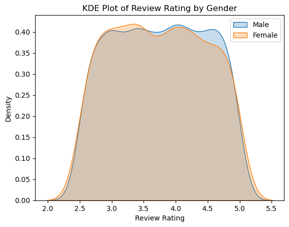
    


<div style="padding:10px;
            color:#87CEEB;
            margin:10px;
            font-size:130%;
            display:fill;
            border-radius:5px;
            border-style: solid;
            border-color: #87CEEB;
            background-color:#000000;
            overflow:hidden;
            font-weight:400"><b> Thank You For Reviewing the project !! Please share feedback </b>
</div>
